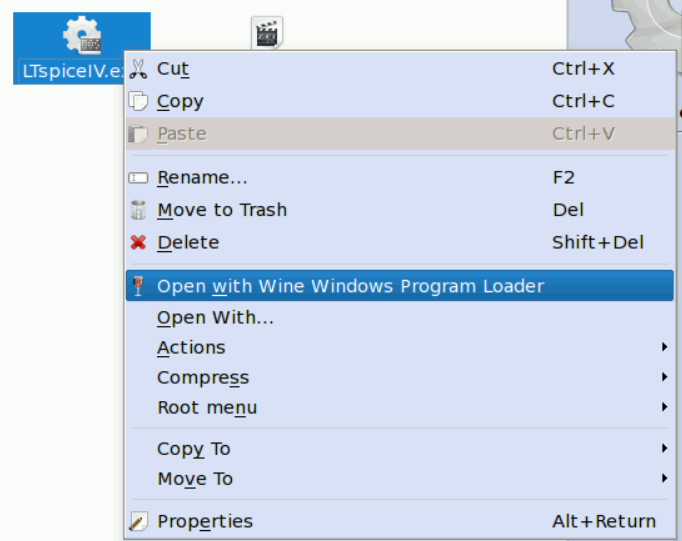
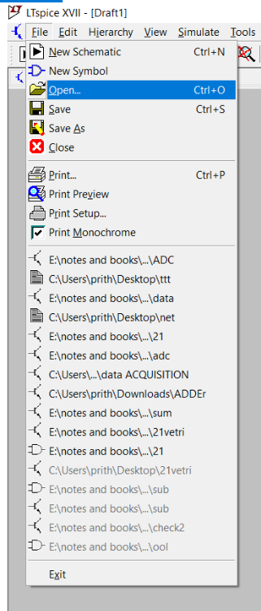
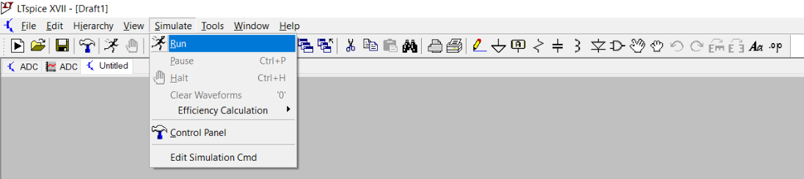
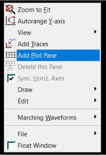
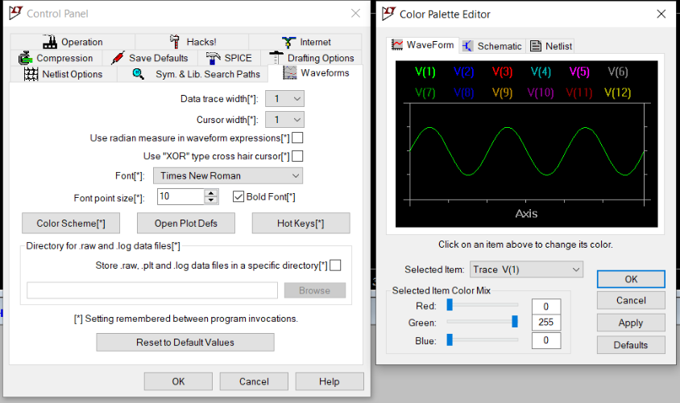
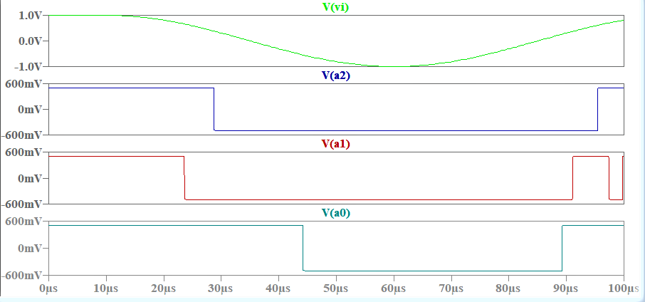
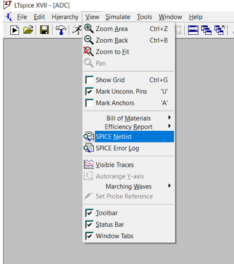

# Applications - Analog Multiplexer
This project aims at developing an Analog multiplexer. Analog multiplexers are employed in various fields.  
Few applications of analog multiplexers are studied and simulated using appropriate spice tool. Detailed  
steps to view the schematic and waveforms are mentioned below.

## Tool Used

LT spice is used to simulate the applications of analog multiplexers. Ltspice is a spice  
simulation software produced by semiconductor manufacturer Analog Devices. This spice tool  
is easier to work with. You can make your schematic and also view the output waveforms  
with the help of a single file with extension as .asc.

## Setup
To view the .asc files you require **LTspice** application in your PC. Following steps will  
help you download and install the application in your PC .

**WINDOWS and Mac**
1. Download the setup file from **Analog Devices** webpage.
   * Click the download link here to take you to the website. [DOWNLOAD](https://www.analog.com/en/design-center/design-tools-and-calculators/ltspice-simulator.html)
2. Click the ``` Download for windows ``` or ``` Download for mac ``` tabs according to your requirement  
   which will will automatically download the setup file into your PC. You can see similar image as given  
   below at Analog devices website.
   
   
   
3. Now follow basic installation steps and install the software.  

**LINUX**
1. LTspice cannot be directly installed on LINUX. LINUX users must install **WINE**. Wine is a linux  
   software that creates windows environment and allows you to run various windows programs. Download  
   wine from [Wine](https://wiki.winehq.org/Download).  
2. Follow similar steps as mentioned for windows to download LTspice setup.  
3. Right click on the downloaded setup file and select the option ```Open With Wine Windows Program Loader```.



4. Accept the license and follow basic installation steps.
## Schematic and Waveforms

### Viewing Schematic
1. Clone the repositary in your desktop or download the zip file and extract all files into  
your pc. The three different .asc files are of three different applications  
   of analog multiplexers.  
2. Open the .asc file directly or open LTspice first and follow the following steps  
   ``` File > Open > Select the .asc files. ``` I'll suggest you to follow the later  
   steps because, sometimes windows might not identify the right application to open the file.
   
   
   
3. Once you have opened the file. You can see the spice schematic. 

## Viewing Waveforms
1. To view the waveforms just click the ``` Simulate ``` tab on the top and select ``` Run ```  
   option which opens a waveform window for you.  
   
   
   
2. Go to schematic and click the nodes at which you wish to view the voltage levels.

3. To view the various node voltages in different plots simultaneously, just right click on the  
   waveform window and select Add Plot Pane. This will add an extra pane to view the wave forms.  
   You can add as many number of panes according to your requirement.



4. If you feel like changing  the color of the waveforms or background,  
   ``` Tools > Control Panel > Waveforms > Color Scheme ```.  


    
   ***Schematic and input output waveforms of Analog to Digital converter is shown below.***

## ADC ##
This is a comparator multiplexer based ADC. In this example I have used a sine wave as my input(Vi).  
A2 A1 A0 are the Digital output bits. The waveforms of other two applications can be obtained from  
Waveforms file in the repositary.




### Spice Netlist
You can view the spice netlist of your schematic. ``` View > Spice Netlist ```.



A text box that contains the spice netlist opens up.  
Follow the following steps to use the spice netlist to view your waveforms:
1. Copy the spice netlist to notepad and save the file with extension as .cir. 
2. Open LTspice and drag the .cir file into the LTspice window, which opens the netlist in LTspice. 
3. Type the command ``` .print XX``` below the command ```.tran``` . Here XX denotes the label of the quantity used.


4. To view the waveforms just click the ``` Simulate ``` tab on the top and select ``` Run ```  
   option which opens a waveform window along with the waveform of the node mentioned in the previous step.  

    If any wrong label is entered, a dialogue box opens containing the list of all nodes and labels available.
    
## Tool to be Used

NGSPICE can be used to view the input output waveforms. NGSPICE is an open source mixed-signal circuit  
simulator. It is the result of combining existing SPICE features with some extra analyses, modeling  
methods and device simulation features.

## SETUP

**WINDOWS and Mac**  
1. NGSPICE zip file should be downloaded. The ZIP file can be downloaded from [Here](http://ngspice.sourceforge.net/download.html).  
2. Once downloaded extract the files in a folder of your convenience.
3. The netlist files should be saved inside the same folder, so choose your location accordingly.

**Ubuntu LINUX**
1. LINUX users, open the LINUX terminal and write the following command and press ENTER:  
   ```sudo apt-get install ngspice```
2. Type your Password and press ENTER.

   
   
3. NGSPICE will be installed in a couple of minutes.

## Viewing Waveforms

**WINDOWS and Mac**
1. After done with the extraction of the zip file, open the folder where you can see a folder named ```Spice64```.
2. Open the ```Spice64``` folder followed by another folder named ```bin```.
3. Create a new text document and paste the contents of netlist file from the repositary into the text file.
4. Save the text document with the extension **.cir** in the same location.
5. Open the ```ngspice``` applicaion in the bin folder and type the name of the .cir file saved in the previous  
   step along with the extension. Say for example if the file name is ABC, type ABC.cir in the box.
6. Press ENTER and respective waveforms appear.

**LINUX**
1. Open any text document and copy the contents of the netlist file from the repositary into the text file.
2. Save the text file with extension as **.cir** in a location of your choice. Say the file is saved as  
   ABC.cir at Documents.
3. Open the LINUX terminal and write the command ```ngspice``` and press enter.

   
   
4. Type the path of the file saved in step 2 and and press enter. For example for the mentioned in step 2,  
   the command is ```Documents/adc.cir```.
   
   
   
5. Respective waveforms appear.
    
## Contact Details
   **Prithivi Raj K  National Institute of Technology Tiruchirapalli prithivjp@gmail.com**  
   **Kunal Ghosh  Co-Founder at VLSI System Design(VSD) kunalpghosh@gmail.com**  
