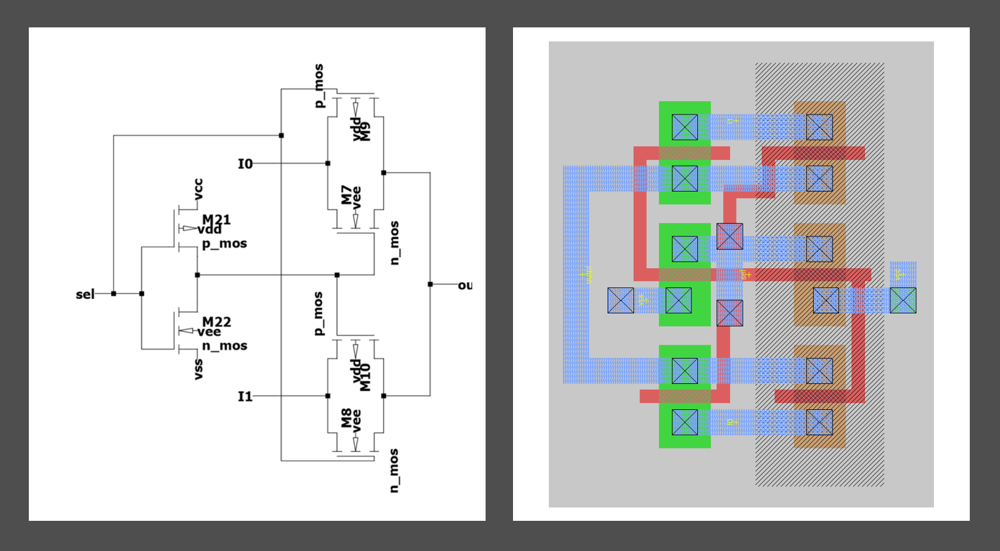
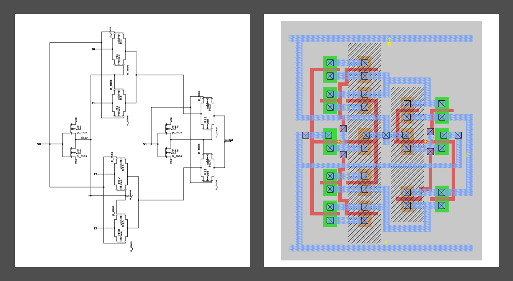
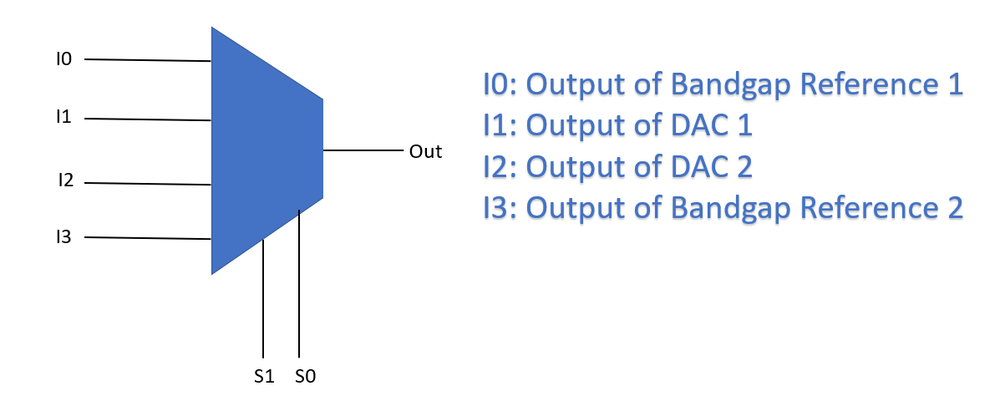
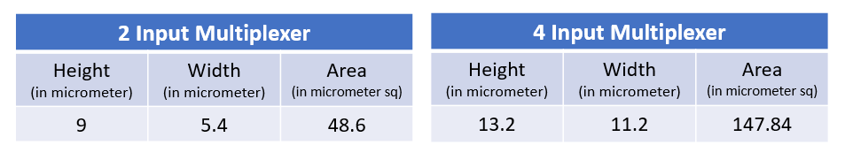
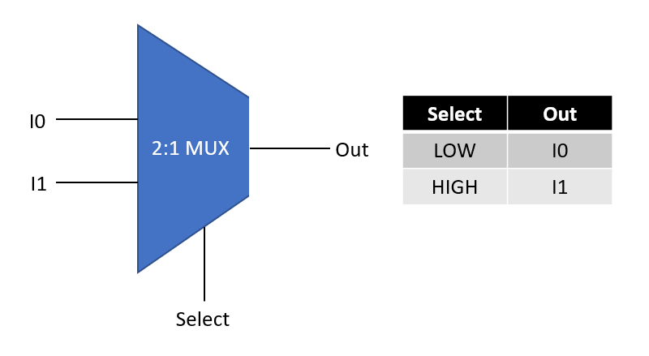
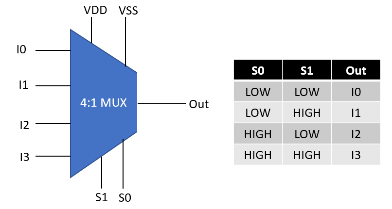

# Analog Multiplexer
This project aims at developing an Analog multiplexer. Analog multiplexers are employed in various fields.  
Few applications of analog multiplexers were studied and simulated using appropriate spice tool. Detailed  
steps to view the schematic and waveforms are mentioned below.

## Tool Used

LT spice is used to simulate the applications of analog multiplexers. Ltspice is a spice  
simulation software produced by semiconductor manufacturer Analog Devices. This spice tool  
is easier to work with. You can make your schematic and also view the output waveforms  
with the help of a single file with extension as .asc. Spice tools like **NGSPICE** can also  
be used to view the input output waveforms. Instructioins t0o view waveforms using these  
are discussed below.

## NGSPICE

NGSPICE can be used to view the input output waveforms. NGSPICE is an open source mixed-signal circuit  
simulator. It is the result of combining existing SPICE features with some extra analyses, modeling  
methods and device simulation features.

## SETUP

**WINDOWS and Mac**  
1. NGSPICE zip file should be downloaded. The ZIP file can be downloaded from [Here](http://ngspice.sourceforge.net/download.html). 

   

2. Once downloaded extract the files in a folder of your convenience.
3. The netlist files should be saved inside the same folder, so choose your location accordingly.

**Ubuntu LINUX**
1. LINUX users, open the LINUX terminal and write the following command and press ENTER:  
   ```sudo apt-get install ngspice```
2. Type your Password and press ENTER.

   
   
3. NGSPICE will be installed in a couple of minutes.

## Viewing Waveforms

**WINDOWS and Mac**
1. After done with the extraction of the zip file, open the folder where you can see a folder named ```Spice64```.
2. Open the ```Spice64``` folder followed by another folder named ```bin```.
3. Create a new text document and paste the contents of netlist file from the repositary into the text file.
4. Save the text document with the extension **.cir** in the same location.
5. Open the ```ngspice``` applicaion in the bin folder and type the name of the .cir file saved in the previous  
   step along with the extension. Say for example if the file name is Data_Acquisition, type Data_Acquisition.cir in the box.
   
   
   
6. Press ENTER and respective waveforms appear.

**LINUX**
1. Open any text document and copy the contents of the netlist file from the repositary into the text file.
2. Save the text file with extension as **.cir** in a location of your choice. Say the file is saved as  
   Data_Acquisition.cir at Documents.
3. Instead of copying, the .cir file can be used directly.
4. Open the LINUX terminal and write the command ```ngspice``` and press enter.

   
   
5. Type the path of the file saved in step 2 and and press enter. For example for the mentioned in step 2,  
   the command is ```Documents/Data_Acquisition.cir```.
   
   
   
6. Respective waveforms appear.

## LTspice

## Setup
To view the .asc files you require **LTspice** application in your PC. Following steps will  
help you download and install the application in your PC .

**WINDOWS and Mac**
1. Download the setup file from **Analog Devices** webpage.
   * Click the download link here to take you to the website. [DOWNLOAD](https://www.analog.com/en/design-center/design-tools-and-calculators/ltspice-simulator.html)
2. Click the ``` Download for windows ``` or ``` Download for mac ``` tabs according to your requirement  
   which will will automatically download the setup file into your PC. You can see similar image as given  
   below at Analog devices website.
   
   
   
3. Now follow basic installation steps and install the software.  

**LINUX**
1. LTspice cannot be directly installed on LINUX. LINUX users must install **WINE**. Wine is a linux  
   software that creates windows environment and allows you to run various windows programs. Download  
   wine from [Wine](https://wiki.winehq.org/Download).  
2. Follow similar steps as mentioned for windows to download LTspice setup.  
3. Right click on the downloaded setup file and select the option ```Open With Wine Windows Program Loader```.


4. Accept the license and follow basic installation steps.
## Schematic and Waveforms

### Viewing Schematic
1. Clone the repositary in your desktop or download the zip file and extract all files into  
your pc. The three different .asc files are of three different applications  
   of analog multiplexers.  
2. Open the .asc file directly or open LTspice first and follow the following steps  
   ``` File > Open > Select the .asc files. ``` I'll suggest you to follow the later  
   steps because, sometimes windows might not identify the right application to open the file.
   
   
   
3. Once you have opened the file. You can see the spice schematic. 

## Viewing Waveforms
1. To view the waveforms just click the ``` Simulate ``` tab on the top and select ``` Run ```  
   option which opens a waveform window for you.  
   
   
   
2. Go to schematic and click the nodes at which you wish to view the voltage levels.

3. To view the various node voltages in different plots simultaneously, just right click on the  
   waveform window and select Add Plot Pane. This will add an extra pane to view the wave forms.  
   You can add as many number of panes according to your requirement.


4. If you feel like changing  the color of the waveforms or background,  
   ``` Tools > Control Panel > Waveforms > Color Scheme ```.  


    
   ***Schematic and input output waveforms of Analog to Digital converter is shown below.***

## ADC ##
This is a comparator multiplexer based ADC. In this example I have used a sine wave as my input(Vi).  
A2 A1 A0 are the Digital output bits. The waveforms of other two applications can be obtained from  
Waveforms file in the repositary.


### Spice Netlist
You can view the spice netlist of your schematic. ``` View > Spice Netlist ```.


A text box that contains the spice netlist opens up.  
Follow the following steps to use the spice netlist to view your waveforms:
1. Copy the spice netlist to notepad and save the file with extension as .cir. 
2. Open LTspice and drag the .cir file into the LTspice window, which opens the netlist in LTspice. 
3. Type the command ``` .print XX``` below the command ```.tran``` . Here XX denotes the label of the quantity used.


4. To view the waveforms just click the ``` Simulate ``` tab on the top and select ``` Run ```  
   option which opens a waveform window along with the waveform of the node mentioned in the previous step.  

    If any wrong label is entered, a dialogue box opens containing the list of all nodes and labels available.
    
## Pre Layout and Post Layout characteristics
The schematic and the layout of the 2 input and 4 input analog multiplexer are given below:





The inputs of the multiplexer are basically the outputs of DAC and Bandgap Reference. Such models were created  
and simulated. The spice netlist corresponding to the model is available in folder Netlist named **model.cir**.  
Block diagram and output waveforms are shown below.




# Characteristics
Four different inputs were given to the analog multiplexer model and the characteristics of pre and post layout  
were compared. Very slight glitches and some little variations were seen in the post layout characteristics  
due to physical factors like the capacitance of polysilicon.


# avsdmux4x1_3v3 and avsdmux2x1_3v3
**avsdmux4x1_3v3 and avsdmux2x1_3v3** corresponds to 4 input and 2 input analog multiplexer.The inputs that  
avsdmux4x1_3v3 and avsdmux2x1_3v3 will be handling are mostly the output from Bandgap reference and Digital 
to Analog cinverters. The height, width and area of avsdmux4x1_3v3 and avsdmux2x1_3v3 is given below.



## Symbol and Pin Description
*In a 2 input analog multiplexer there is a total of 6 pins*
1. Two input pins. (I0 and I1)
2. One Select signal pins. (select)
3. Output pin. (Out)
4. Power pins (VDD and VSS)



*In a 4  input analog multiplexer there is a total of 9 pins*
1. Four input pins. (I0, I1, I2, I3)
2. Two Select signal pins. (S0 and S1)
3. Output pin. (Out)
4. Power pins (VDD and VSS)




## Forthcoming Work  
The design of analog multiplexer is done and its characteristics were verified till the post layout stage.  
As a next step in the future PnR (Place and Route) woks will be carried out and an entire chip design will  
be done. PnR will be done with the help of OpenROAD tools.

## IP Usage 
To view the IP characteristics and layout you have to install **NGSPICE and MAGIC VLSI Layout tool**. The  
setup and usage steps are mentioned below.

## NGSPICE
NGSPICE can be used to view the input output waveforms using spice netlist. NGSPICE is an open source mixed-signal circuit  
simulator. It is the result of combining existing SPICE features with some extra analyses, modeling  
methods and device simulation features.

## SETUP
**WINDOWS and Mac**  
1. NGSPICE zip file should be downloaded. The ZIP file can be downloaded from [Here](http://ngspice.sourceforge.net/download.html). 

   

2. Once downloaded extract the files in a folder of your convenience.
3. The netlist files should be saved inside the same folder, so choose your location accordingly.

**Ubuntu LINUX**
1. LINUX users, open the LINUX terminal and write the following command and press ENTER:  
   ```sudo apt-get install ngspice```
2. Type your Password and press ENTER.

   
   
3. NGSPICE will be installed in a couple of minutes.

## MAGIC VLSI Layout Tool
Magic is a venerable VLSI layout tool, written in the 1980's at Berkeley by John Ousterhout. It is  
largely used for academic purpose and also used by small companiies.

## SETUP
1. Clone the repositary using command ```git clone https://github.com/prithivjp/Analog-Multiplexer.git```
2. You can find a file **magic.sh** and a file **SCN6M_SUBM.10.tech** inside the folder MAGIC in the  
   repositary, copy both files to Home.
3. Open Terminal and run the following two commands:
      ```chmod +x magic.sh```
      ```./magic.sh```
4. MAGIC will be installed in a couple of minutes.
5. Since OSU 180nm technology is used you have to include the apprpriate tech file. Run the following command
      ```sudo cp SCN6M_SUBM.10.tech /usr/local/lib/magic/sys/```
      
 ## Viewing Characteristics using NGSPICE 
**WINDOWS and Mac**
1. After done with the extraction of the NGSPICE zip file, open the folder where you can see a folder named ```Spice64```.
2. Open the ```Spice64``` folder followed by another folder named ```bin```.
3. Copy the netlist files (.cir and .spice) and the library files(.lib) from the folder Netlists in the repositary and  
   save them inside bin folder mentioned above.
4. Open the ```ngspice``` applicaion in the bin folder and type the name of the .cir file saved in the previous  
   step along with the extension. Say for example if the file name is Data_Acquisition, type Data_Acquisition.cir in the box.
   
   
   
5. Press ENTER and respective waveforms appear.

**LINUX**
1. Copy the netlist files (.cir and .spice) and the library files(.lib) from the folder Netlists in the repositary to  
   some location. Also copy the library files to home also.
2. Open the LINUX terminal and write the command ```ngspice``` and press enter.

   
   
3. Type the path of the file saved in step 2 and and press enter. For example if the netlist files are  
   saved in Documents the command is ```Documents/Data_Acquisition.cir```.
   
   
   
4. Respective waveforms appear.

## Viewing Layout
1. After cloning the repositary copy the layout files (.mag) in the folder Layout to some location.
2. Right click on the new folder where the layout files are saved and click ```Open in terminal```.
3. Say, you want to open the layout of 41mux. Then type the following command and press enter  
   ```magic -T SCN6M_SUBM.10.tech 41mux.mag```
4. If you wish to view the spice file of the layout, open the tkcon window and enter the following  
   commands one by one:
         ```save```  
         ```ext```  
         ```ext2spice```
5. You can see the spice file in the same folder as that of your layout file.

    To run the post layout simulations, you have to add certain lines to the spice file extracted  
    such as library file include commands, voltage descriptions of input and power pins and simulation  
    commands such as **tran and control** commands. Such spice files are already made availabel in the 
    folder netlist.
   
## Pre Layout and Post Layout characteristics
The schematic and the layout of the 2 input and 4 input analog multiplexer are given below:


The layout image with supply rails is available in the folder **Layout** in the repositary.
The inputs of the multiplexer are basically the outputs of DAC and Bandgap Reference. Such models were created  
by combining the models of my peers using LTspice. The spice netlist corresponding to the model is available in  
folder Netlist named **model.cir**.Due to unavailability of model Output of Bandgap Reference 2 is taken as a  
constant voltage source and the model is checked. Block diagram and output waveforms are shown below.


   

## Characteristics
Four different inputs were given to the analog multiplexer model and the characteristics of pre and post layout  
were compared. Very slight glitches and some little variations were seen in the post layout characteristics.  
The respective spice files for pre layout and post layout (both 2 input and 4 input multiplexer) is available  
in the folder **Netlist** in the repositary. Follow the steps mentioned in the **Viewing Characteristics** part  
of README.


Above characteristics corresponds to 4 input Multiplexer. Pre layout and Postlayout characteristics of a 2  
input Multiplexer is available in the repositary (Folder name: Characteristics).

For any dissimilarities found between the pre layout and postlayout characteristics or any difficulties with  
respect to IP Usage, contact the administrator or report in issues section of github.
    
## Contact Details
   **Prithivi Raj K  National Institute of Technology Tiruchirapalli prithivjp@gmail.com**  
   **Kunal Ghosh  Co-Founder at VLSI System Design(VSD) kunalpghosh@gmail.com**  
